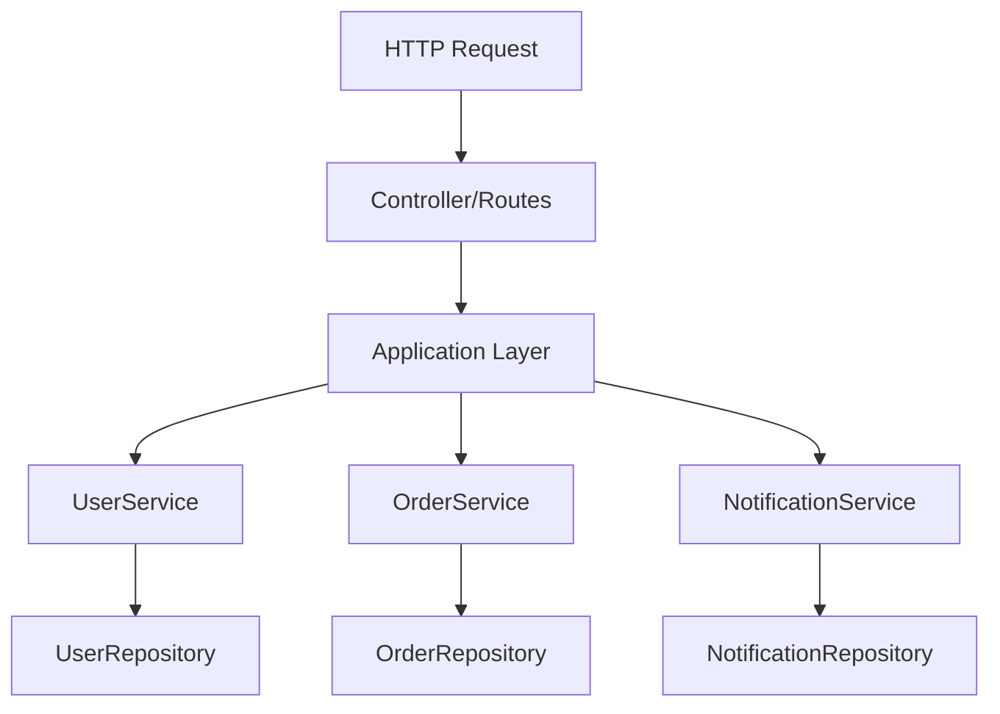

# Design Document

## Overview

Ktor 프레임워크를 사용하여 코루틴과 DSL을 학습할 수 있는 실습 프로젝트입니다. 4개의 명확한 레이어(Repository, Service, Application, Controller)로 구성되며, 각 레이어에서 코루틴이 어떻게 사용되고 조합되는지 보여줍니다.

### 핵심 학습 목표

1. **레이어 간 코루틴 흐름**: suspend 함수가 레이어를 통과하며 어떻게 전파되는지
2. **병렬 처리**: async/await를 사용한 여러 서비스의 동시 실행
3. **DSL 활용**: Ktor routing DSL과 커스텀 DSL 빌더
4. **비동기 시뮬레이션**: delay를 사용한 실제 비동기 작업 모방

## Architecture

### Layer Structure

```
Controller (Routing)
    ↓ calls
Application (Service Composition)
    ↓ calls multiple
Services (Business Logic)
    ↓ calls
Repository (Data Access)
```

### Component Diagram




### Coroutine Flow Pattern

각 레이어에서 코루틴이 어떻게 사용되는지:

1. **Controller**: suspend 함수로 라우트 정의, Application 레이어 호출
2. **Application**: coroutineScope로 여러 서비스를 async/await로 병렬 실행
3. **Service**: suspend 함수로 비즈니스 로직 처리, Repository 호출
4. **Repository**: delay로 비동기 작업 시뮬레이션, in-memory 데이터 반환

## Components and Interfaces

### 1. Repository Layer

**Purpose**: 데이터 접근을 시뮬레이션하고 delay를 통해 비동기 작업을 보여줌

**Components**:
- `UserRepository`: 사용자 데이터 관리
- `OrderRepository`: 주문 데이터 관리
- `NotificationRepository`: 알림 데이터 관리

**Interface Example**:
```kotlin
interface UserRepository {
    suspend fun findAll(): List<User>
    suspend fun findById(id: Long): User?
    suspend fun create(user: User): User
    suspend fun update(id: Long, user: User): User?
    suspend fun delete(id: Long): Boolean
}
```

**Coroutine Usage**:
- 모든 메서드는 `suspend` 함수
- `delay(100..500ms)`로 데이터베이스 작업 시뮬레이션
- `mutableMapOf`로 in-memory 데이터 저장

### 2. Service Layer

**Purpose**: 독립적인 비즈니스 로직 처리, Repository 호출

**Components**:
- `UserService`: 사용자 관련 비즈니스 로직
- `OrderService`: 주문 관련 비즈니스 로직
- `NotificationService`: 알림 발송 로직

**Interface Example**:
```kotlin
interface UserService {
    suspend fun getAllUsers(): List<User>
    suspend fun getUserById(id: Long): User?
    suspend fun createUser(name: String, email: String): User
    suspend fun updateUser(id: Long, name: String, email: String): User?
    suspend fun deleteUser(id: Long): Boolean
}
```

**Coroutine Usage**:
- `suspend` 함수로 Repository 호출
- 필요시 여러 Repository 호출을 순차적으로 처리
- 비즈니스 로직 검증 및 변환


### 3. Application Layer

**Purpose**: 여러 서비스를 조합하고 병렬 실행을 통해 코루틴의 강력함을 보여줌

**Components**:
- `UserApplication`: 사용자 관련 복합 작업 (사용자 + 주문 + 알림)
- `DashboardApplication`: 대시보드 데이터 조합 (여러 서비스 병렬 호출)

**Interface Example**:
```kotlin
class UserApplication(
    private val userService: UserService,
    private val orderService: OrderService,
    private val notificationService: NotificationService
) {
    suspend fun getUserWithDetails(userId: Long): UserDetails
    suspend fun createUserWithWelcome(name: String, email: String): UserCreationResult
    suspend fun getDashboardData(): DashboardData
}
```

**Coroutine Usage** (핵심 학습 포인트):
```kotlin
// 병렬 실행 예제
suspend fun getDashboardData(): DashboardData = coroutineScope {
    val usersDeferred = async { userService.getAllUsers() }
    val ordersDeferred = async { orderService.getAllOrders() }
    val statsDeferred = async { orderService.getStatistics() }
    
    DashboardData(
        users = usersDeferred.await(),
        orders = ordersDeferred.await(),
        stats = statsDeferred.await()
    )
}

// 순차 실행 예제
suspend fun createUserWithWelcome(name: String, email: String): UserCreationResult {
    val user = userService.createUser(name, email)
    val notification = notificationService.sendWelcomeEmail(user.email)
    return UserCreationResult(user, notification)
}
```

### 4. Controller Layer

**Purpose**: HTTP 라우팅 정의, Ktor DSL 사용, Application 레이어 호출

**Components**:
- `userRoutes`: 사용자 CRUD 엔드포인트
- `dashboardRoutes`: 대시보드 엔드포인트

**Ktor DSL Example**:
```kotlin
fun Route.userRoutes(userApplication: UserApplication) {
    route("/users") {
        get {
            val users = userApplication.getAllUsers()
            call.respond(users)
        }
        
        post {
            val request = call.receive<CreateUserRequest>()
            val result = userApplication.createUserWithWelcome(request.name, request.email)
            call.respond(HttpStatusCode.Created, result)
        }
        
        get("/{id}") {
            val id = call.parameters["id"]?.toLongOrNull()
            // ...
        }
    }
}
```

**Coroutine Usage**:
- Ktor의 모든 라우트 핸들러는 자동으로 코루틴 컨텍스트에서 실행
- `call.respond()`는 suspend 함수
- Application 레이어의 suspend 함수를 직접 호출


## Data Models

### Core Domain Models

```kotlin
data class User(
    val id: Long,
    val name: String,
    val email: String,
    val createdAt: Long = System.currentTimeMillis()
)

data class Order(
    val id: Long,
    val userId: Long,
    val productName: String,
    val amount: Double,
    val status: OrderStatus,
    val createdAt: Long = System.currentTimeMillis()
)

enum class OrderStatus {
    PENDING, PROCESSING, COMPLETED, CANCELLED
}

data class Notification(
    val id: Long,
    val userId: Long,
    val message: String,
    val type: NotificationType,
    val sentAt: Long = System.currentTimeMillis()
)

enum class NotificationType {
    EMAIL, SMS, PUSH
}
```

### Application Layer Models

```kotlin
data class UserDetails(
    val user: User,
    val orders: List<Order>,
    val recentNotifications: List<Notification>
)

data class UserCreationResult(
    val user: User,
    val welcomeNotification: Notification
)

data class DashboardData(
    val users: List<User>,
    val orders: List<Order>,
    val stats: OrderStatistics
)

data class OrderStatistics(
    val totalOrders: Int,
    val totalAmount: Double,
    val averageAmount: Double
)
```

### Request/Response Models

```kotlin
@Serializable
data class CreateUserRequest(
    val name: String,
    val email: String
)

@Serializable
data class UpdateUserRequest(
    val name: String?,
    val email: String?
)

@Serializable
data class CreateOrderRequest(
    val userId: Long,
    val productName: String,
    val amount: Double
)
```


## Error Handling

### Exception Hierarchy

```kotlin
sealed class AppException(message: String) : Exception(message)

class UserNotFoundException(userId: Long) : AppException("User not found: $userId")
class OrderNotFoundException(orderId: Long) : AppException("Order not found: $orderId")
class InvalidRequestException(message: String) : AppException(message)
class ServiceException(message: String, cause: Throwable? = null) : AppException(message)
```

### Error Handling in Coroutines

각 레이어에서의 에러 처리:

**Repository Layer**:
```kotlin
suspend fun findById(id: Long): User? {
    delay(200) // 시뮬레이션
    return users[id] // null 반환 가능
}
```

**Service Layer**:
```kotlin
suspend fun getUserById(id: Long): User {
    return userRepository.findById(id) 
        ?: throw UserNotFoundException(id)
}
```

**Application Layer**:
```kotlin
suspend fun getUserWithDetails(userId: Long): UserDetails = coroutineScope {
    try {
        val userDeferred = async { userService.getUserById(userId) }
        val ordersDeferred = async { orderService.getOrdersByUserId(userId) }
        val notificationsDeferred = async { notificationService.getRecentByUserId(userId) }
        
        UserDetails(
            user = userDeferred.await(),
            orders = ordersDeferred.await(),
            recentNotifications = notificationsDeferred.await()
        )
    } catch (e: Exception) {
        throw ServiceException("Failed to get user details", e)
    }
}
```

**Controller Layer**:
```kotlin
install(StatusPages) {
    exception<UserNotFoundException> { call, cause ->
        call.respond(HttpStatusCode.NotFound, mapOf("error" to cause.message))
    }
    exception<InvalidRequestException> { call, cause ->
        call.respond(HttpStatusCode.BadRequest, mapOf("error" to cause.message))
    }
    exception<Exception> { call, cause ->
        call.respond(HttpStatusCode.InternalServerError, mapOf("error" to "Internal server error"))
    }
}
```


## Testing Strategy

### Unit Testing

각 레이어를 독립적으로 테스트:

**Repository Test**:
```kotlin
@Test
fun `should simulate delay in findAll`() = runTest {
    val repository = UserRepositoryImpl()
    val startTime = System.currentTimeMillis()
    repository.findAll()
    val duration = System.currentTimeMillis() - startTime
    assertTrue(duration >= 100) // delay 확인
}
```

**Service Test**:
```kotlin
@Test
fun `should throw exception when user not found`() = runTest {
    val mockRepository = mockk<UserRepository>()
    coEvery { mockRepository.findById(1L) } returns null
    
    val service = UserServiceImpl(mockRepository)
    assertThrows<UserNotFoundException> {
        service.getUserById(1L)
    }
}
```

**Application Test**:
```kotlin
@Test
fun `should execute services in parallel`() = runTest {
    val application = UserApplication(userService, orderService, notificationService)
    val startTime = System.currentTimeMillis()
    application.getDashboardData()
    val duration = System.currentTimeMillis() - startTime
    
    // 병렬 실행이므로 순차 실행보다 빨라야 함
    assertTrue(duration < 600) // 각 서비스가 200ms씩이면 순차는 600ms
}
```

### Integration Testing

Ktor 테스트 엔진 사용:

```kotlin
@Test
fun `should create user and return 201`() = testApplication {
    application {
        configureRouting()
        configureSerialization()
    }
    
    client.post("/users") {
        contentType(ContentType.Application.Json)
        setBody(CreateUserRequest("John", "john@example.com"))
    }.apply {
        assertEquals(HttpStatusCode.Created, status)
    }
}
```


## DSL Usage Examples

### 1. Ktor Routing DSL

```kotlin
fun Application.configureRouting() {
    routing {
        route("/api") {
            userRoutes(userApplication)
            orderRoutes(orderApplication)
            dashboardRoutes(dashboardApplication)
        }
    }
}
```

### 2. Custom DSL for Repository Configuration

```kotlin
class RepositoryConfig {
    var delayRange: LongRange = 100L..300L
    var initialData: MutableList<Any> = mutableListOf()
    
    fun delay(range: LongRange) {
        delayRange = range
    }
    
    fun initialUsers(block: () -> List<User>) {
        initialData.addAll(block())
    }
}

fun repository(block: RepositoryConfig.() -> Unit): RepositoryConfig {
    return RepositoryConfig().apply(block)
}

// 사용 예제
val config = repository {
    delay(200L..500L)
    initialUsers {
        listOf(
            User(1, "Alice", "alice@example.com"),
            User(2, "Bob", "bob@example.com")
        )
    }
}
```

### 3. Custom DSL for Application Composition

```kotlin
class ApplicationBuilder {
    private val services = mutableMapOf<String, Any>()
    
    fun <T> service(name: String, instance: T) {
        services[name] = instance as Any
    }
    
    inline fun <reified T> get(name: String): T {
        return services[name] as T
    }
}

fun application(block: ApplicationBuilder.() -> Unit): ApplicationBuilder {
    return ApplicationBuilder().apply(block)
}

// 사용 예제
val app = application {
    service("userService", UserServiceImpl(userRepository))
    service("orderService", OrderServiceImpl(orderRepository))
    service("notificationService", NotificationServiceImpl(notificationRepository))
}
```


## Project Structure

```
src/
├── main/
│   ├── kotlin/
│   │   └── com/
│   │       └── example/
│   │           ├── Application.kt                 # Ktor 애플리케이션 진입점
│   │           ├── plugins/
│   │           │   ├── Routing.kt                # 라우팅 설정
│   │           │   ├── Serialization.kt          # JSON 직렬화 설정
│   │           │   └── StatusPages.kt            # 에러 핸들링 설정
│   │           ├── domain/
│   │           │   └── model/
│   │           │       ├── User.kt               # 도메인 모델
│   │           │       ├── Order.kt
│   │           │       └── Notification.kt
│   │           ├── repository/
│   │           │   ├── UserRepository.kt         # Repository 인터페이스
│   │           │   ├── UserRepositoryImpl.kt     # Repository 구현
│   │           │   ├── OrderRepository.kt
│   │           │   ├── OrderRepositoryImpl.kt
│   │           │   ├── NotificationRepository.kt
│   │           │   └── NotificationRepositoryImpl.kt
│   │           ├── service/
│   │           │   ├── UserService.kt            # Service 인터페이스
│   │           │   ├── UserServiceImpl.kt        # Service 구현
│   │           │   ├── OrderService.kt
│   │           │   ├── OrderServiceImpl.kt
│   │           │   ├── NotificationService.kt
│   │           │   └── NotificationServiceImpl.kt
│   │           ├── application/
│   │           │   ├── UserApplication.kt        # Application 레이어
│   │           │   └── DashboardApplication.kt
│   │           ├── controller/
│   │           │   ├── UserRoutes.kt             # 라우트 정의
│   │           │   ├── OrderRoutes.kt
│   │           │   └── DashboardRoutes.kt
│   │           └── dto/
│   │               ├── UserDto.kt                # Request/Response DTO
│   │               ├── OrderDto.kt
│   │               └── DashboardDto.kt
│   └── resources/
│       ├── application.conf                      # Ktor 설정
│       └── logback.xml                           # 로깅 설정
└── test/
    └── kotlin/
        └── com/
            └── example/
                ├── repository/
                │   └── UserRepositoryTest.kt
                ├── service/
                │   └── UserServiceTest.kt
                ├── application/
                │   └── UserApplicationTest.kt
                └── controller/
                    └── UserRoutesTest.kt
```

## Dependencies

### build.gradle.kts

```kotlin
dependencies {
    // Ktor Server
    implementation("io.ktor:ktor-server-core:2.3.7")
    implementation("io.ktor:ktor-server-netty:2.3.7")
    implementation("io.ktor:ktor-server-content-negotiation:2.3.7")
    implementation("io.ktor:ktor-server-status-pages:2.3.7")
    
    // Serialization
    implementation("io.ktor:ktor-serialization-kotlinx-json:2.3.7")
    
    // Coroutines
    implementation("org.jetbrains.kotlinx:kotlinx-coroutines-core:1.7.3")
    
    // Logging
    implementation("ch.qos.logback:logback-classic:1.4.11")
    
    // Testing
    testImplementation("io.ktor:ktor-server-test-host:2.3.7")
    testImplementation("org.jetbrains.kotlin:kotlin-test")
    testImplementation("org.jetbrains.kotlinx:kotlinx-coroutines-test:1.7.3")
}
```


## Coroutine Learning Guide Structure

프로젝트 완성 후 생성될 학습 문서의 구조:

### COROUTINE_GUIDE.md

이 문서는 다음 섹션으로 구성됩니다:

1. **개요**
   - 코루틴이란 무엇인가
   - 이 프로젝트에서 배울 수 있는 것

2. **레이어별 코루틴 사용**
   - Repository 레이어: suspend 함수와 delay
   - Service 레이어: suspend 함수 체이닝
   - Application 레이어: async/await와 병렬 처리
   - Controller 레이어: Ktor의 코루틴 통합

3. **코루틴 패턴 상세 설명**
   - suspend 함수 정의와 호출
   - coroutineScope와 구조화된 동시성
   - async/await를 사용한 병렬 실행
   - launch를 사용한 fire-and-forget
   - 에러 처리와 취소

4. **실제 코드 예제**
   - 각 패턴의 실제 구현 위치
   - 코드 스니펫과 설명
   - 실행 흐름 다이어그램

5. **성능 비교**
   - 순차 실행 vs 병렬 실행
   - 실제 측정 결과

6. **베스트 프랙티스**
   - 코루틴 사용 시 주의사항
   - 일반적인 실수와 해결 방법

7. **추가 학습 자료**
   - 공식 문서 링크
   - 추천 학습 경로

## Implementation Notes

### Logging for Learning

코루틴 실행 흐름을 이해하기 위한 로깅:

```kotlin
suspend fun getUserWithDetails(userId: Long): UserDetails = coroutineScope {
    logger.info("Starting getUserWithDetails for userId: $userId")
    
    val userDeferred = async {
        logger.info("Fetching user data...")
        userService.getUserById(userId)
    }
    
    val ordersDeferred = async {
        logger.info("Fetching orders data...")
        orderService.getOrdersByUserId(userId)
    }
    
    val notificationsDeferred = async {
        logger.info("Fetching notifications data...")
        notificationService.getRecentByUserId(userId)
    }
    
    logger.info("Waiting for all data...")
    val result = UserDetails(
        user = userDeferred.await(),
        orders = ordersDeferred.await(),
        recentNotifications = notificationsDeferred.await()
    )
    
    logger.info("Completed getUserWithDetails")
    result
}
```

### Sample Data Initialization

학습을 위한 초기 데이터:

```kotlin
fun initializeSampleData() {
    // Users
    userRepository.create(User(1, "Alice", "alice@example.com"))
    userRepository.create(User(2, "Bob", "bob@example.com"))
    userRepository.create(User(3, "Charlie", "charlie@example.com"))
    
    // Orders
    orderRepository.create(Order(1, 1, "Laptop", 1200.0, OrderStatus.COMPLETED))
    orderRepository.create(Order(2, 1, "Mouse", 25.0, OrderStatus.COMPLETED))
    orderRepository.create(Order(3, 2, "Keyboard", 80.0, OrderStatus.PENDING))
    
    // Notifications
    notificationRepository.create(Notification(1, 1, "Welcome!", NotificationType.EMAIL))
    notificationRepository.create(Notification(2, 2, "Order confirmed", NotificationType.EMAIL))
}
```

## API Endpoints

### User Endpoints

- `GET /api/users` - 모든 사용자 조회
- `GET /api/users/{id}` - 특정 사용자 조회
- `GET /api/users/{id}/details` - 사용자 상세 정보 (주문, 알림 포함)
- `POST /api/users` - 사용자 생성 (환영 알림 자동 발송)
- `PUT /api/users/{id}` - 사용자 수정
- `DELETE /api/users/{id}` - 사용자 삭제

### Order Endpoints

- `GET /api/orders` - 모든 주문 조회
- `GET /api/orders/{id}` - 특정 주문 조회
- `GET /api/orders/user/{userId}` - 특정 사용자의 주문 조회
- `POST /api/orders` - 주문 생성
- `PUT /api/orders/{id}/status` - 주문 상태 변경

### Dashboard Endpoints

- `GET /api/dashboard` - 대시보드 데이터 (병렬 처리 예제)
- `GET /api/dashboard/stats` - 통계 데이터

## Summary

이 설계는 다음을 제공합니다:

1. **명확한 레이어 분리**: Repository → Service → Application → Controller
2. **다양한 코루틴 패턴**: suspend, async/await, coroutineScope, delay
3. **실용적인 DSL 사용**: Ktor routing, 커스텀 DSL 빌더
4. **학습 중심 구조**: 로깅, 주석, 가이드 문서
5. **실행 가능한 예제**: 완전한 CRUD API와 복합 작업

모든 코드는 학습 목적으로 최적화되어 있으며, 실제 프로덕션 코드보다 명확성과 교육적 가치를 우선합니다.
